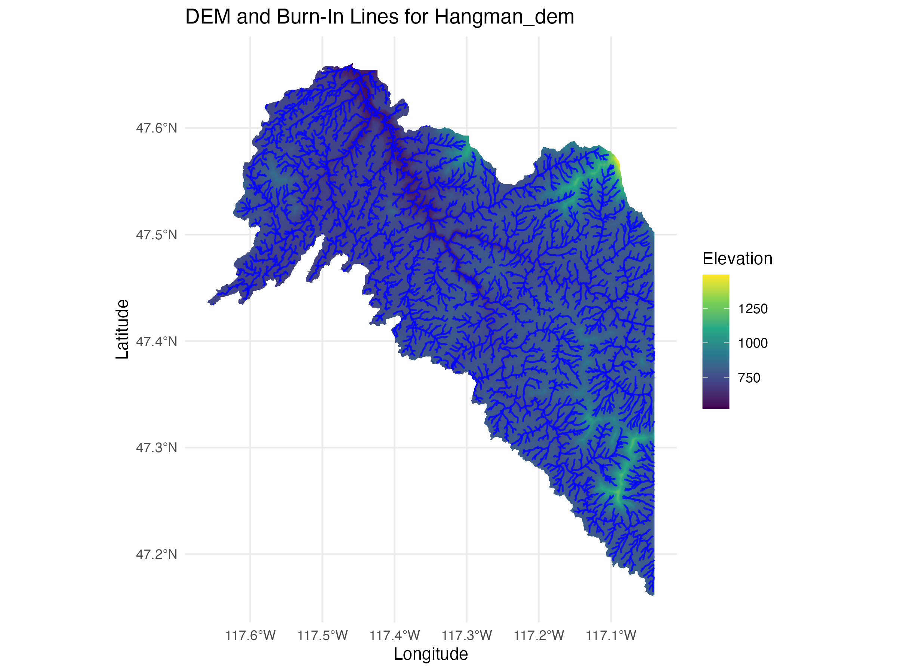

# **Washington State DEM Processing Workflow**



This repository contains scripts for processing 1/3 arc sec Digital Elevation Models (DEMs) of Washington State, including downloading, merging, clipping by WRIA boundaries, and hydrological analysis (e.g., D8 burn-in of streams). The workflow is organized into several steps, detailed below.

------------------------------------------------------------------------

## **1. Prerequisites**

### **Tools Required**

-   **GDAL**: Geospatial Data Abstraction Library

-   **Whitebox Tools**: Advanced geospatial analysis

-   **R**

### **R Libraries**

```         
r install.packages(c("tidyverse", "raster", "sf", "here", "sp", "job"))
devtools::install_github("giswqs/whiteboxR")  # For Whitebox Tools in R
```

------------------------------------------------------------------------

## **2. Workflow Overview**

### **Step 1: Download DEMs**

Script: `01_pull_all_dems.sh`

This script downloads all USGS DEMs covering Washington State and saves them to the directory:

```         
~/Downloads/usgs_dems
```

**Usage**

Run the script from the terminal:

```         
bash 01_pull_all_dems.sh
```

Alternatively you could manually download using the <https://apps.nationalmap.gov/downloader/> tool.

------------------------------------------------------------------------

### **Step 2: Merge DEMs**

Script: `02_dem_merge.sh`

This script merges all downloaded DEM files into a single raster:

```         
~/Downloads/usgs_dems/merged_dem.tif
```

#### **Usage**

Run the script:

```         
bash 02_dem_merge.sh
```

------------------------------------------------------------------------

### **Step 3: Isolate WRIA Shapefiles**

Script: `03_wria_isolate.sh`

Download the WRIA shapefiles from <https://geo.wa.gov/datasets/waecy>::water-resource-inventory-areas-wria/explore?location=47.196913%2C-120.817600%2C7.26 to \~/Downloads/wria_shapefiles. This script then extracts individual shapefiles for each WRIA (Water Resource Inventory Area) in Washington State, based on the WRIA boundary shapefile:

```         
~/Downloads/wria_shapefiles
```

#### **Usage**

Ensure you have the WRIA shapefile (e.g., `WRIA.shp`) and run:

```         
bash 03_wria_isolate.sh
```

------------------------------------------------------------------------

### **Step 4: Clip DEMs by WRIA**

Script: `04_wria_clip.sh`

This script clips the statewide DEM into individual WRIA-specific DEMs using the WRIA shapefiles. The outputs are saved in:

```         
~/Downloads/usgs_dems/clipped_wrias
```

#### **Usage**

Run the script:

```         
bash 04_wria_clip.sh
```

------------------------------------------------------------------------

### **Step 5: Hydrology Burn-In**

Script: `05_wria_burn_in.R`

This R script processes each WRIA-specific DEM for hydrological analysis. It performs the following:

1.  **Breach Depressions**: Remove artificial depressions.

2.  **Fill Depressions**: Fill breached DEMs.

3.  **Flow Accumulation**: Compute flow accumulation grids.

4.  **Stream Extraction**: Generate vector stream networks for hydrological analysis.

The outputs include:

-   Processed DEMs (`base_rasters`, `breaches`)

-   Burned-in hydrological streams (`burn_in`)

#### **Usage**

Run the script in R:

```         
source("05_wria_burn_in.R")
```

------------------------------------------------------------------------

### **Step 6: Combine Burn-In Outputs**

The script combines individual burn-in shapefiles into a single shapefile with attributes joined from the WRIA boundary data:

-   **Input**: Processed WRIA streams (`burn_in`) and WRIA boundary shapefile (`WRIA.shp`).

-   **Output**: Combined shapefile with attributes (e.g., WRIA_NM, WRIA_NR, WRIA_AREA\_).

#### **Key Output**

```         
output/wria_burn_ins.shp
```

------------------------------------------------------------------------

## **3. Directory Structure**

```         
├── 01_pull_all_dems.sh       # Downloads USGS DEMs
├── 02_dem_merge.sh           # Merges DEMs into a single raster
├── 03_wria_isolate.sh        # Isolates WRIA-specific shapefiles
├── 04_wria_clip.sh           # Clips statewide DEM by WRIA boundaries
├── 05_wria_burn_in.R         # Hydrological analysis of WRIA DEMs
├── data/
│   ├── raw/                  # Raw input data (e.g., WRIA shapefiles)
│   ├── processed/            # Processed outputs
│   └── output/               # Final outputs (e.g., combined shapefiles)
```

------------------------------------------------------------------------

## **4. Example Outputs**

### **Final Outputs**

1.  **Merged DEM**: `~/Downloads/usgs_dems/merged_dem.tif`

2.  **WRIA-Specific DEMs**: `~/Downloads/usgs_dems/clipped_wrias`

3.  **Burned-In Stream Networks**: `data/processed/burn_in`

4.  **Combined Shapefile**: `output/wria_burn_ins.shp`

------------------------------------------------------------------------

## **5. Notes**

-   **GDAL Tools**: Ensure `gdal_merge.py` and `gdalwarp` are accessible in your environment.

-   **Whitebox Tools**: Install Whitebox Tools for R using `whitebox::install_whitebox()`.

-   **Error Handling**: Scripts assume directory structures are correctly set up. Modify paths as needed.
